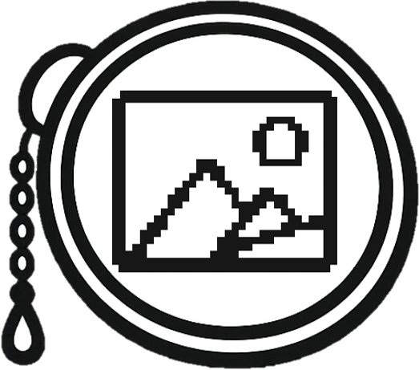
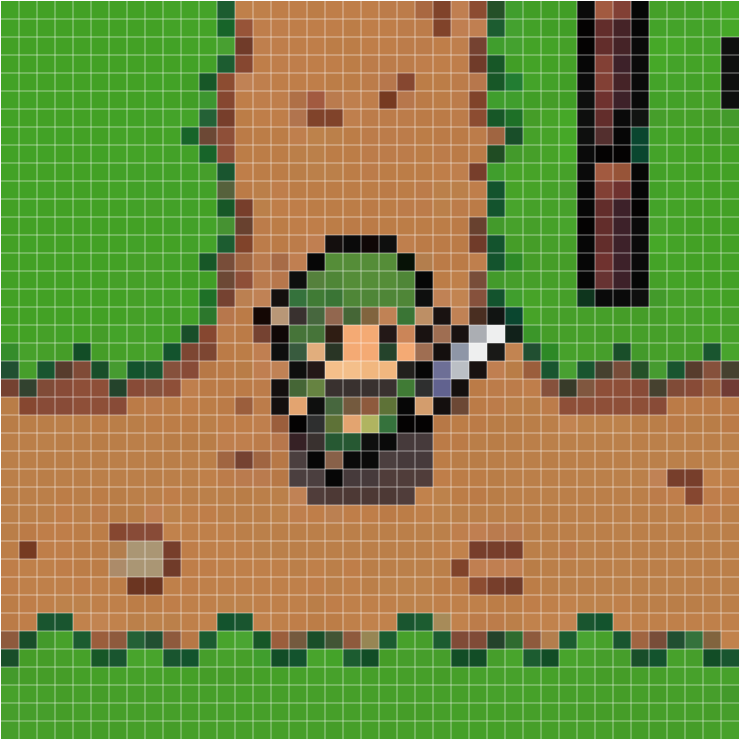
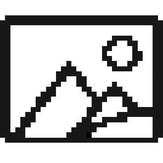
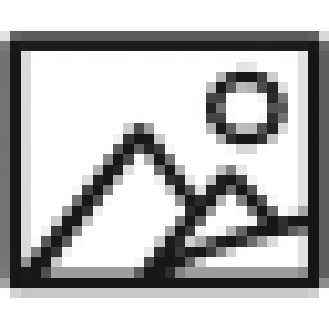

# MonoPix

<p align="center">
  
</p>

**偽物のピクセルアートを本物にしよう**

高速・無料・ブラウザで完結。サーバー不要、アカウント不要。

  

[English](./README.md) · [한국어](./README.ko.md) · [中文](./README.zh.md) · [Español](./README.es.md)

---

## 今すぐ試す

**[www.mono-pix.com](https://www.mono-pix.com)**

---

## Snap — 偽ピクセルアートを本物のピクセルアートに

AIが生成した画像がピクセルアートに*見える*けど、実は本物じゃない。ぼやけたエッジ、アンチエイリアスのかかった境界、ズレたグリッド。**Snap モードは元のピクセルグリッドを自動検出し、すべてのセルをきれいな単一色で再構築します。** 透明度も保持されます。解像度を設定する必要はありません。

| 変換前（ぼやけ、グリッドずれ）                                      | 変換後（クリーン、均一）                                           | 変換後 + グリッドオーバーレイ                                                  |
| ------------------------------------------------------------------- | ------------------------------------------------------------------ | ------------------------------------------------------------------------------ |
|  |  |  |

[`fast-pixelizer`](https://github.com/handsupmin/fast-pixelizer) をベースに動作しています。

**入力品質について**

ChatGPT が作る「ピクセルアート風」画像は、Snap の入力としては品質が低いことがあります。見た目はピクセルアートでも、元画像の時点でセル幅やセル高さが不均一だったり、境界がぼやけていたり、軸が微妙にずれていたりすることが多いからです。Snap は結果を整えることはできますが、最初から格子が一貫していない画像については、完全な復元品質を保証できません。

Snap 用の入力を新しく生成するなら、Nano Banana のように、最初から正方形の低解像度グリッドをより安定して保てる生成経路をおすすめします。

---

## 主な機能

- **Snap** — AIが作った「なんちゃってピクセルアート」を本物に再構築。グリッド自動検出、透明度保持
- **クロップ** — ドラッグ＆ズーム対応の 1:1 アスペクト比エディター
- **クリーン (Clean)** — セルの最頻出色を使用。シャープでグラフィカルな仕上がり。8×8〜256×256
- **ディテール (Detail)** — セルの平均色を使用。滑らかなグラデーションと豊かなテクスチャ
- **比較** — 変換前 / 変換後 / 分割比較ビュー
- **ダウンロード** — PNGで出力、元サイズ維持または選択した解像度にリサイズ
- **履歴** — 直近10件をブラウザにローカル保存
- **多言語** — 英語、韓国語、日本語、中国語（簡体字）、スペイン語

すべての処理はWeb Workerで実行。データは一切外部に送信されません。

---

## 使用例

| 元画像                                                             | クリーン                                                            | ディテール                                                             |
| ------------------------------------------------------------------ | ------------------------------------------------------------------- | ---------------------------------------------------------------------- |
|  |  |  |

**クリーン** は各セルの最頻出色を選択 — くっきりシャープな仕上がり。

**ディテール** は各セルの平均色を使用 — 滑らかなグラデーションと豊かなテクスチャ。

---

## セットアップ

**必要環境:** Node.js 18 以上

```bash
git clone https://github.com/handsupmin/mono-pix.git
cd mono-pix
npm install
npm run dev
```

[http://localhost:5173](http://localhost:5173) を開いてください。

---

## スクリプト

| コマンド           | 説明                   |
| ------------------ | ---------------------- |
| `npm run dev`      | 開発サーバー起動       |
| `npm run build`    | プロダクションビルド   |
| `npm run preview`  | ビルド結果のプレビュー |
| `npm run lint`     | ESLint 実行            |
| `npm run lint:fix` | ESLint 自動修正        |
| `npm run format`   | Prettier フォーマット  |

---

## 技術スタック

[React 19](https://react.dev) · [TypeScript 5.9](https://www.typescriptlang.org) · [Vite](https://vite.dev) · [Tailwind CSS v4](https://tailwindcss.com) · [shadcn/ui](https://ui.shadcn.com) · [Zustand](https://zustand-demo.pmnd.rs) · [fast-pixelizer](https://github.com/handsupmin/fast-pixelizer) · [Dexie.js](https://dexie.org) · [react-easy-crop](https://github.com/ValentinH/react-easy-crop) · [react-i18next](https://react.i18next.com)

---

## コントリビュート

コントリビューションはいつでも大歓迎です！リポジトリを Fork して、ブランチを作って、PR を送ってください。

```bash
npm run lint:fix   # lint エラーを自動修正
npm run format     # コードをフォーマット
npm run build      # ビルドが通るか確認
```

---

## サポート

MonoPix を気に入っていただけたら、コーヒーをおごってください！

[](https://ko-fi.com/handsupmin)

---

## ライセンス

MIT
